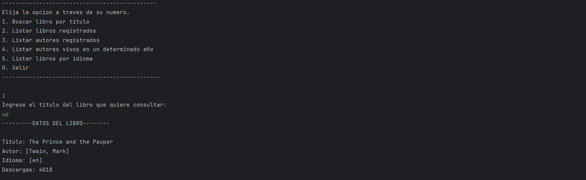
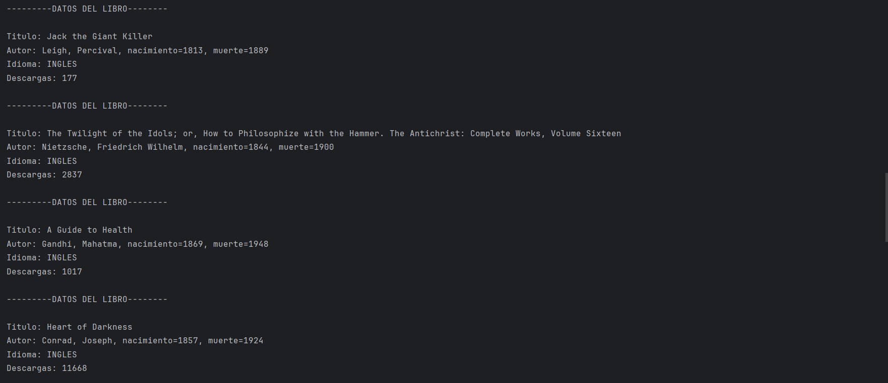
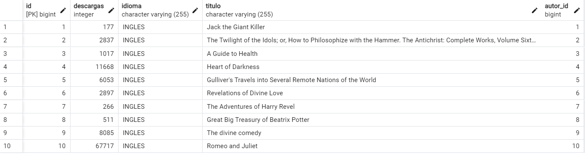
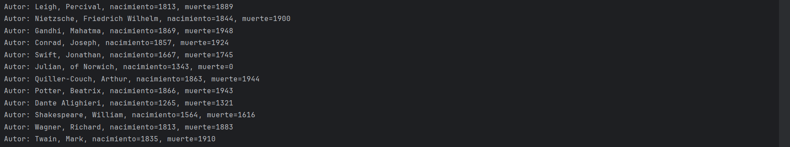
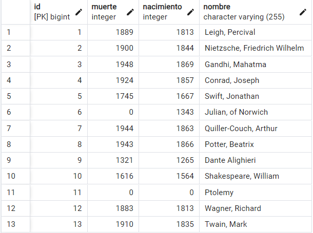
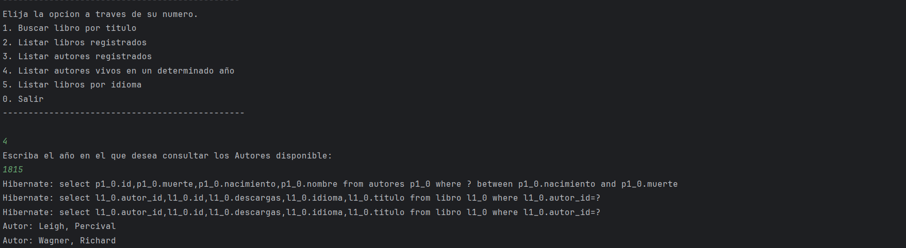
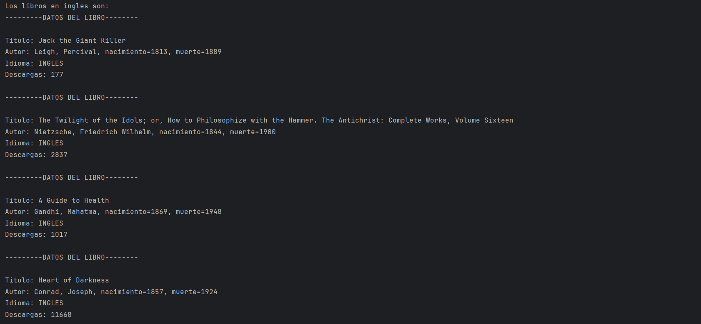

<h1> LiterAlura.<h1/>

Este proyecto consiste en la busqueda y registro de libros, con la ayuda del API Gutendex que nos proporciona algunos datos de Libros y sus Autores

En este proyecto se utilizaron herramientas como:
<ul>
  <li>Java POO</li>
  <li>Consumo API</li>
  <li>Spring Data</li>
  <li>Libreria JPA y Jackson</li>
  <li>DB PostgreSQL</li>
  <li>Protocolo HTTP</li>
</ul>

A continuacion de muesta el menu y sus funciones.

<h3>Busqueda de Libros por titulo</h3>

<h3>Listado de libros registrados en base de datos</h3>

<h3>Listado de Autores registrados en base de datos</h3>

<h3>Autores vivos en determinado año</h3>

<h3>Listado de libros por idioma</h3>

